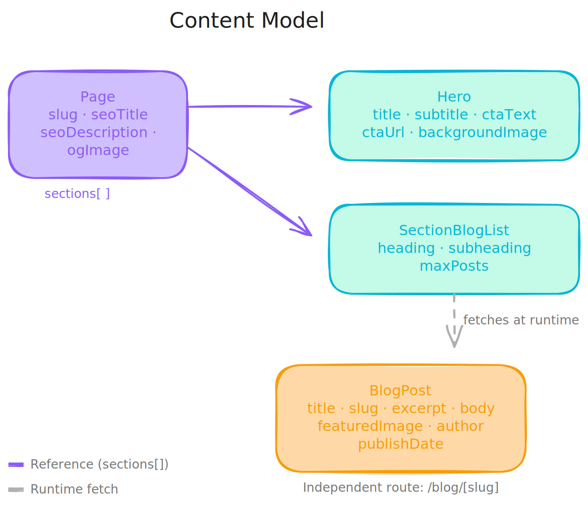

# Pulse CMS

A marketing site built with **Next.js 15** and **Contentful** as a headless CMS, demonstrating a production-ready CMS-driven architecture with composable pages, Draft Mode preview, and on-demand ISR.

## Why this project

This project was built as a practical demonstration for a Full-Stack Engineer position focused on **Next.js + Contentful architecture**. The job description emphasized CMS-driven development where Contentful acts as the primary backend, server-side rendering strategies, draft/preview/published content states, and reusable frontend components.

Rather than building a generic portfolio piece, the goal was to replicate the exact patterns and workflows a content-heavy engineering team would use in production.

## Scope definition

With a limited time budget, scope was defined by prioritizing what demonstrates the most value to a hiring manager and product stakeholder:

**In scope:** composable page architecture, content modeling with decoupled sections, Draft Mode with Contentful Preview API, ISR with on-demand revalidation via webhooks, type-safe data layer, SCSS modules with semantic HTML, and responsive design.

**Out of scope:** localization, Live Preview (real-time editing), authentication, testing infrastructure, GraphQL (used REST API via SDK), and complex animations.

The guiding principle was: *if a content editor can create a page, preview it, publish it, and see it live without developer intervention — the architecture works.*

## Content model

The content model follows Contentful's **composable pages** pattern. Pages are containers with an ordered array of section references. Sections are self-contained content types that map 1:1 to frontend components. Blog posts live independently with their own routing.




```
Page (slug="/")
  └── sections: [ Hero, SectionBlogList ]

Page (slug="/blog")
  └── sections: [ SectionBlogList ]

BlogPost (independent, route: /blog/[slug])
```

**Page** — Container with SEO metadata (`seoTitle`, `seoDescription`, `ogImage`) and a `sections` field that accepts an ordered array of Hero and SectionBlogList references. The editor controls page composition by dragging and reordering sections.

**Hero** — Full-width hero section with `title`, `subtitle`, `ctaText`, `ctaUrl`, and `backgroundImage`. Designed as a reusable section that could appear on any page.

**SectionBlogList** — Configurable blog listing section with `heading`, `subheading`, and `maxPosts`. The frontend fetches posts at runtime based on `maxPosts`, keeping the section decoupled from specific blog post entries.

**BlogPost** — Independent content type with `title`, `slug`, `excerpt`, `featuredImage`, `body` (Rich Text), `author`, and `publishDate`. Has its own dynamic route and is not referenced by Page entries directly.

This architecture means adding a new section type requires only: creating the content type in Contentful, building the corresponding component, and registering it in the section mapper. No page-level changes needed.

## Tech stack and architecture decisions

### Next.js 15 (App Router)

All pages use React Server Components. Data fetching happens at the server level with no client-side API calls for content. Rendering strategies are chosen per route: SSG with ISR for all pages, with a 60-second fallback revalidation and on-demand revalidation via Contentful webhooks.

### Type safety

Content types are auto-generated from Contentful's schema using `cf-content-types-generator`. The generated types include skeleton types for SDK queries, resolved entry types for components, and runtime type guard functions (`isTypeHero`, `isTypeSectionBlogList`) used in the section mapper instead of manual string comparisons.

The Contentful client uses `withoutUnresolvableLinks()` so TypeScript correctly infers resolved assets and references without manual casting. Types flow end-to-end: from Contentful SDK → fetch functions → components, with zero `as` casts in component code.

### SCSS Modules

Styling uses SCSS Modules with BEM-like naming conventions (`.hero__title`, `.card__body`). Design tokens are centralized in `_variables.scss` covering colors, typography (DM Serif Display for headings, DM Sans for body), spacing scale, and responsive breakpoints. Mobile-first approach with breakpoints at 640px, 768px, and 1024px.

### Caching strategy

Data fetching is wrapped with React `cache()` in a separate `cached-contentful.ts` module, deduplicating identical calls within a single server render pass. The raw fetch functions in `contentful.ts` remain uncached for use in API routes (webhooks, revalidation) where fresh data is required. ISR handles inter-request caching with on-demand invalidation.

### Draft Mode and Content Preview

Draft Mode uses Next.js `draftMode()` API. When enabled, pages switch from the Delivery API to the Preview API, rendering unpublished content. The flow:

1. Content editor opens a draft entry in Contentful
2. Clicks "Open Preview" (configured in Contentful's Content Preview settings)
3. Browser hits `/api/draft?secret=...&slug=...` → enables draft cookie → redirects to the page
4. Page fetches from Preview API → renders draft content with a visible banner
5. Editor clicks "Exit Draft Mode" → disables cookie → returns to published view

### On-demand revalidation

A webhook endpoint at `/api/revalidate` receives POST requests from Contentful on publish/unpublish events. It validates a secret header, then calls `revalidatePath()` for affected routes. For blog posts, it parses the payload to revalidate the specific `/blog/[slug]` path.

## Project structure

```
src/
  @types/              ← Auto-generated Contentful types (do not edit)
  lib/
    contentful.ts      ← SDK clients + fetch functions
    cached-contentful.ts ← React cache() wrappers
    utils.ts           ← Shared utilities (formatDate, assetUrl)
  components/
    SectionRenderer.tsx ← Maps section entries to components via type guards
    Hero/              ← Hero section component + SCSS module
    BlogListSection/   ← Async server component, fetches its own data
    BlogCard/          ← Post card for listings
    RichTextRenderer/  ← Contentful Rich Text → React with embedded asset support
  styles/
    _variables.scss    ← Design tokens
    globals.scss       ← Reset, layout, navbar, footer, draft banner
  app/
    layout.tsx         ← Root layout with nav, footer, draft mode banner
    page.tsx           ← Home (fetches Page with slug="/")
    blog/
      page.tsx         ← Blog listing (fetches Page with slug="/blog")
      [slug]/page.tsx  ← Blog detail with generateStaticParams + ISR
    api/
      draft/           ← Enable Draft Mode
      disable-draft/   ← Disable Draft Mode
      revalidate/      ← Contentful webhook for on-demand ISR
```

## Running locally

```bash
git clone https://github.com/your-username/pulse-cms.git
cd pulse-cms
npm install
```

Create `.env.local` with your Contentful credentials:

```
CONTENTFUL_SPACE_ID=your_space_id
CONTENTFUL_ACCESS_TOKEN=your_delivery_token
CONTENTFUL_PREVIEW_ACCESS_TOKEN=your_preview_token
CONTENTFUL_PREVIEW_SECRET=your_draft_mode_secret
```

```bash
npm run dev
```

## Testing Draft Mode locally

1. Create or edit a Blog Post in Contentful without publishing
2. Navigate to `http://localhost:3000/api/draft?secret=your_secret&slug=/blog/your-slug`
3. You should see the draft content with a yellow banner at the top
4. Visit `http://localhost:3000/api/disable-draft` to exit

## Deployment

Deployed on Vercel. Environment variables are configured in Vercel's dashboard. A Contentful webhook triggers on-demand revalidation on publish/unpublish events via `/api/revalidate` with secret header validation.
